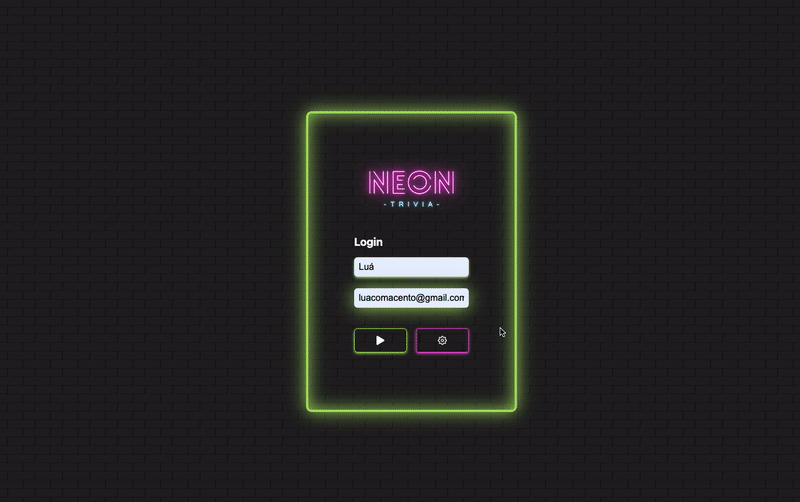

## Neon Trivia

## About:

A trivia game, where users can play up to five questions in different subjects!

The goal was to create a game in which a player can use their e-mail to login (and their profile pic is automatically recovered from Gravatar, and then play a trivia game with five questions in various topics. After the game is played, the user score is saved in their localStorage, so they can play again later to try and beat themselves, or even invite a friend to play!

The app consumes two public APIs, one for the questions and answers and another one for the user avatar.

It was developed with <b>React.js</b> and <b>Redux.js</b> for state managing.

You can <a href="https://luacomacento.github.io/trivia-game/" target="_blank">click here</a> to check the current state of the application.

## Tools:
<ul>
  <li>React.js</li>
  <li>Redux</li>
  <li>CSS3</li>
</ul>

## Made by:
This app was made as a group project, alongside my dear friends Romulo, Halister, Isabella and Thiago.

## In works:
I am not currently working on this project.
